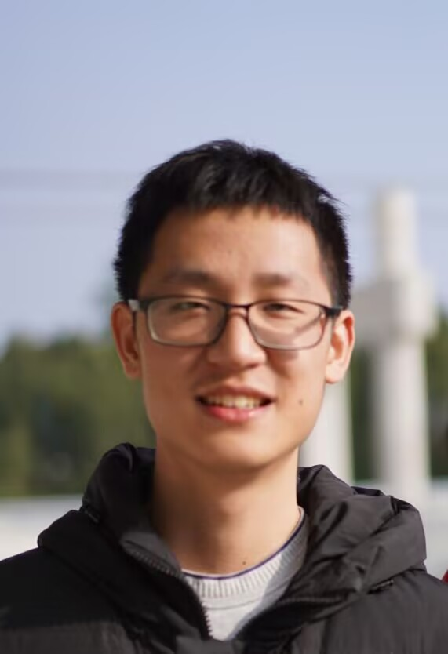

  

    <h1>Shicheng Fan</h1>
    
👋 I am a first-year CS Ph.D. student (Aug. 2025–) at <a href="https://www.uic.edu/">University of Illinois Chicago (UIC)</a>, advised by Prof. <a href="https://lcheng.org/">Lu Cheng</a>. 

    
My current research focuses on <strong>Causal Representation Learning</strong>, specifically developing frameworks that extend causal representation learning from discrete to continuous mechanism transitions using mixture-of-experts architectures. I am also broadly interested in <strong>Causal Inference</strong> and <strong>Trustworthy AI</strong>.

  

  

    
  

  <a href="mailto:YOUR_EMAIL@uic.edu">📧 Email</a> /
  <a href="https://scholar.google.com/">🎓 Google Scholar</a> /
  <a href="https://github.com/">😺 Github</a>

<!-- TODO: Add more links as needed: Twitter, LinkedIn, etc. -->

## 🎉 News

<ul class="news-list">
  <li>[2026.01] Submitted paper <strong><em>TRACE</em></strong> to <strong>ICML 2026</strong>: Trajectory Recovery for Continuous Mechanism Evolution in Causal Representation Learning.</li>
  <li>[2025.08] Started Ph.D. at UIC! 🎓</li>
</ul>

<!-- TODO: Add more news items as they come -->

## 🎓 Education

  
  
<strong>University of Illinois Chicago</strong> , Ph.D. in Computer Science , <em>08/2025 - present</em>

<!-- TODO: Add your previous education below -->
<!--

  
  
<strong>Your Undergraduate University</strong> , B.S. , <em>XX/20XX - XX/20XX</em>

-->

## 📝 Publications and Preprints

### First-author

* **Shicheng Fan**, Lu Cheng, Kun Zhang. [TRACE: Trajectory Recovery for Continuous Mechanism Evolution in Causal Representation Learning]() ICML 2026, Under Review
 📄 Paper (coming soon) / 📦 Code (coming soon)

<!-- TODO: Add more publications as they come -->

### Collaborative Publications

<!-- TODO: Add collaborative publications here -->

## 🔬 Research Experience

  
  
<strong>University of Illinois Chicago</strong> — Graduate Research Assistant <em>08/2025 - present</em> · Advisor: <a href="https://lcheng.org/">Lu Cheng</a>, Collaborator: <a href="https://www.andrew.cmu.edu/user/kunz1/">Kun Zhang</a> Causal Representation Learning, Mixture-of-Experts architectures for continuous mechanism transitions

<!-- TODO: Add previous research experiences -->

## 👨‍💻 Academic Services

<!-- TODO: Add reviewer experience, etc. -->
<!-- Example:
* Reviewer of NeurIPS 2026, ICML 2026
-->

## 🏆 Awards & Honors

<!-- TODO: Add awards and scholarships -->
<!-- Example:
* **Some Scholarship**, *Year*
-->
