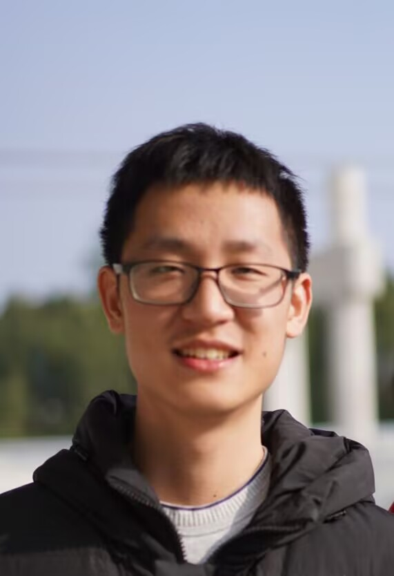
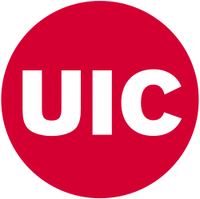
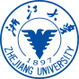

  

    <h1>Shicheng Fan</h1>
    

      <a href="mailto:shicheng0222@gmail.com">📧 Email</a> /
      <a href="https://scholar.google.com/citations?user=Mk-thxsAAAAJ&hl=en">🎓 Google Scholar</a> /
      <a href="https://github.com/shichengf">😺 Github</a> /
      <a href="https://www.linkedin.com/in/shicheng-fan-072935308/">💼 LinkedIn</a>
    

    
👋 I am a first-year CS Ph.D. student (Aug. 2025–) at <a href="https://www.uic.edu/">University of Illinois Chicago (UIC)</a>, advised by Prof. <a href="https://lcheng.org/">Lu Cheng</a>, collaborating with Prof. <a href="https://www.cmu.edu/dietrich/philosophy/people/faculty/zhang.html">Kun Zhang</a> (CMU). I received my B.Eng. from <a href="https://www.zju.edu.cn/english/">Zhejiang University</a> (Chu Kochen Honors College), where I worked on dexterous robotic manipulation with Prof. <a href="https://person.zju.edu.cn/en/yeqi">Qi Ye</a>.

    
My research interests center on <strong>Causality</strong> and its applications in <strong>AI for Science</strong>, <strong>Reinforcement Learning</strong>, and <strong>Large Language Models</strong>.

  

  

    
  

## 🎉 News

<ul class="news-list">
  <li>[2026.04] New arXiv: <strong><em>CoEvoSkills</em></strong> — Self-Evolving Agent Skills via Co-Evolutionary Verification (also <em>under review</em>). <a href="https://arxiv.org/abs/2604.01687">📄 Paper</a></li>
  <li>[2026.04] Excited that <strong><em>TRACE</em></strong> has been <strong>accepted to ICML 2026</strong>! Trajectory Recovery for Continuous Mechanism Evolution in Causal Representation Learning. <a href="https://www.arxiv.org/abs/2601.21135">📄 Paper</a> · <a href="https://github.com/shichengf/trace">💻 Code</a></li>
  <li>[2026.01] Posted the <strong><em>TRACE</em></strong> manuscript on arXiv. <a href="https://www.arxiv.org/abs/2601.21135">📄 Paper</a></li>
  <li>[2025.08] Started Ph.D. at UIC! 🎓</li>
</ul>

## 🎓 Education

  

  
<strong>University of Illinois Chicago</strong> , Ph.D. in Computer Science , <em>08/2025 - present</em>

  

  
<strong>Zhejiang University</strong> , B.Eng. in Automation (Control & Robotics) , <em>09/2021 - 06/2025</em> Chu Kochen Honors College · GPA: 3.98/4.0 · Rank: 6/121 (Top 5%) · Outstanding Graduate

## 📝 Publications and Preprints

### First-author

* **Shicheng Fan**, Kun Zhang, Lu Cheng. [TRACE: Trajectory Recovery for Continuous Mechanism Evolution in Causal Representation Learning](https://www.arxiv.org/abs/2601.21135) ICML 2026
 [📄 Paper](https://www.arxiv.org/abs/2601.21135) / [💻 Code](https://github.com/shichengf/trace)

### Collaborative Publications

* Hanrong Zhang, **Shicheng Fan**, Henry Peng Zou, Yankai Chen, Zhenting Wang, Jiayu Zhou, Chengze Li, Wei-Chieh Huang, Yifei Yao, Kening Zheng, Xue Liu, Xiaoxiao Li, Philip S. Yu. [CoEvoSkills: Self-Evolving Agent Skills via Co-Evolutionary Verification](https://arxiv.org/abs/2604.01687) Under Review <em>Co-first author</em>
 [📄 Paper](https://arxiv.org/abs/2604.01687)

## 🔬 Research Experience

* **CoEvoSkills: Self-Evolving Agent Skills** · *Co-first author* · 2026
  * Studied autonomous skill generation for LLM agents with a co-evolutionary framework coupling a Skill Generator and a Surrogate Verifier
  * Contributed to empirical evaluations on SkillsBench and cross-model generalization analysis across multiple agent backbones

* **TRACE: CRL under Continuous Mechanism Evolution** · *First Author* · 2025–2026
  * Proposed the first theoretical framework extending causal representation learning from discrete mechanism shifts to continuous transitions; proved joint identifiability of latent causal variables and continuous mixture trajectories via nonlinear ICA and variational inference
  * Designed the TRACE framework based on Mixture-of-Experts, where each expert learns an atomic mechanism and time-varying mixture coefficients recover mechanism trajectories at inference

* **Knowledge-Enhanced RL for LLM Factuality Alignment** · *Co-1st Author* · 2025–present
  * Designing an end-to-end LLM post-training pipeline combining SFT and RL for improved factuality alignment

* **Causal Representation Learning for Protein Conformational Transitions** · *1st Author* · 2025–present
  * Applying causal representation learning to molecular dynamics for identifying key residues driving protein conformational transitions

* **Semantic and Goal-Driven Dexterous Hand Manipulation** · *B.Sc. Thesis* · 2024–2025
  * Reproduced the Text2HOI three-stage framework, matching reported performance on H2O, GRAB, and ARCTIC datasets
  * Proposed a Shadow Hand → MANO cross-embodiment retargeting algorithm via skeleton-point alignment and two-stage gradient optimization
  * Joint training with GraspM3 dataset (8000+ objects) improved Physical Realism to 0.897 and reduced penetration volume by ~50%

## 🏆 Awards & Honors

* **Outstanding Graduate**, Zhejiang University, *2025*
* **Academic Excellence Model**, Zhejiang University, *2022, 2023, 2024*
* **Outstanding Student in AI&ML Summer Project**, University of Cambridge, *2023*
* **National Second Prize**, Advanced Mathematics Competition of China, *2022*

## 🏅 Competitions

* **ASC** (Asia Supercomputer Community Challenge), National Second Prize, *2024*
  * Built full HPC system from hardware to software; optimized LLM inference with KV Cache & batching strategies
* **ACM-IPCC** (International Parallel Computing Challenge), National Second Prize, *2022*
  * Optimized program runtime from 13min to 200ms (~4000x speedup) using MPI, CUDA, SIMD
