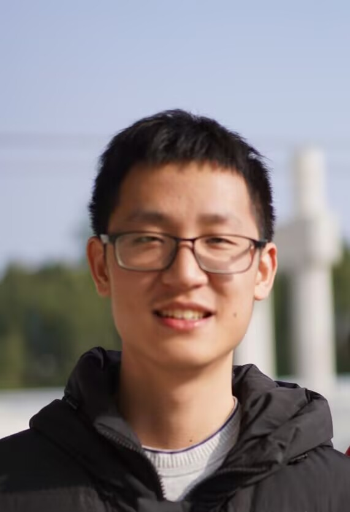

  

    <h1>Shicheng Fan</h1>
    

      <a href="mailto:shicheng0222@gmail.com">📧 Email</a> /
      <a href="https://scholar.google.com/citations?user=Mk-thxsAAAAJ&hl=en">🎓 Google Scholar</a> /
      <a href="https://github.com/shichengf">😺 Github</a> /
      <a href="https://www.linkedin.com/in/shicheng-fan-072935308/">💼 LinkedIn</a>
    

    
👋 I am a CS Ph.D. student (Aug. 2025–) at <a href="https://www.uic.edu/">University of Illinois Chicago (UIC)</a>, where I am fortunate to be advised by Prof. <a href="https://scholar.google.com/citations?user=D0lL1r0AAAAJ&hl=en">Philip S. Yu</a>, and to collaborate with Prof. <a href="https://www.cmu.edu/dietrich/philosophy/people/faculty/zhang.html">Kun Zhang</a> (CMU). I received my B.Eng. from <a href="https://www.zju.edu.cn/english/">Zhejiang University</a> (Chu Kochen Honors College), where I worked on dexterous robotic manipulation with Prof. <a href="https://person.zju.edu.cn/en/yeqi">Qi Ye</a>.

    
My research interests center on <strong>Causality</strong>, <strong>World Model</strong>, <strong>Agent</strong>, and <strong>LLM Post Training</strong>.

    
💬 Always happy to chat about research. Feel free to reach out!

  

  

    
  

## 🎉 News

<ul class="news-list">
  <li>[2026.08] New preprint: <strong><em>ACWorld</em></strong>, Agentic Commerce World: An Auditable and Verifiable Environment for Vibe Commerce. <a href="https://arxiv.org/abs/2608.02441">📄 Paper</a> · <a href="https://github.com/shichengf/ACWorld">💻 Code</a></li>
  <li>[2026.07] New preprint: <strong><em>Paying for Honesty Without Knowing the Truth</em></strong>, Reputation-Penalty Design for LLM Marketplace Agents. <a href="https://arxiv.org/abs/2607.28330">📄 Paper</a></li>
  <li>[2026.07] 🌟 Highlight <strong><em>CoEvoSkills</em></strong> accepted to <strong>COLM 2026</strong>. <a href="https://arxiv.org/abs/2604.01687">📄 Paper</a> · <a href="https://github.com/Zhang-Henry/CoEvoSkills">💻 Code</a></li>
  <li>[2026.06] New preprint: <strong><em>Scaling LLM Agent Learning with Data Synthesis</em></strong>, a comprehensive survey. <a href="https://www.researchgate.net/publication/406488336_Scaling_LLM_Agent_Learning_with_Data_Synthesis_A_Comprehensive_Survey">📄 Paper</a></li>
  <li>[2026.05] New preprint: <strong><em>CorVer</em></strong>, Verifiable Rewards Beyond Math and Code: Lightweight Corpus-Grounded Process Supervision for Factual Question Answering. <a href="https://arxiv.org/abs/2605.29648">📄 Paper</a> · <a href="https://github.com/shichengf/CorVer">💻 Code</a></li>
  <li>[2026.05] New preprint: <strong><em>MOSAIC</em></strong>, Module Discovery via Sparse Additive Identifiable Causal Learning for Scientific Time Series. <a href="https://arxiv.org/abs/2605.05524">📄 Paper</a> · <a href="https://github.com/shichengf/mosaic">💻 Code</a></li>
  <li>[2026.04] 🌟 Highlight <strong><em>TRACE</em></strong> accepted to <strong>ICML 2026</strong>. Trajectory Recovery for Continuous Mechanism Evolution in Causal Representation Learning. <a href="https://www.arxiv.org/abs/2601.21135">📄 Paper</a> · <a href="https://github.com/shichengf/trace">💻 Code</a></li>
  <li>[2026.04] New preprint: <strong><em>CoEvoSkills</em></strong>, Self-Evolving Agent Skills via Co-Evolutionary Verification. <a href="https://arxiv.org/abs/2604.01687">📄 Paper</a> · <a href="https://github.com/Zhang-Henry/CoEvoSkills">💻 Code</a></li>
  <li>[2026.01] New preprint: <strong><em>TRACE</em></strong>, Trajectory Recovery for Continuous Mechanism Evolution in Causal Representation Learning. <a href="https://www.arxiv.org/abs/2601.21135">📄 Paper</a></li>
  <li>[2025.08] Started Ph.D. at UIC! 🎓</li>
</ul>

## 🎓 Education

  

  
<strong>University of Illinois Chicago</strong> , Ph.D. in Computer Science , <em>08/2025–present</em>

  

  
<strong>Zhejiang University</strong> , B.Eng. in Automation (Control & Robotics) , <em>09/2021–06/2025</em> Chu Kochen Honors College · GPA: 3.98/4.0 · Rank: 6/121 (Top 5%) · Outstanding Graduate

## 📝 Publications and Preprints

### First Author

* **Shicheng Fan**, Kun Zhang, Lu Cheng. [TRACE: Trajectory Recovery for Continuous Mechanism Evolution in Causal Representation Learning](https://www.arxiv.org/abs/2601.21135) ICML 2026
 [📄 Paper](https://www.arxiv.org/abs/2601.21135) / [💻 Code](https://github.com/shichengf/trace)

* Hanrong Zhang, **Shicheng Fan**, Henry Peng Zou, Yankai Chen, Zhenting Wang, Jiayu Zhou, Chengze Li, Wei-Chieh Huang, Yifei Yao, Kening Zheng, Xue Liu, Xiaoxiao Li, Philip S. Yu. [CoEvoSkills: Self-Evolving Agent Skills via Co-Evolutionary Verification](https://arxiv.org/abs/2604.01687) COLM 2026
 [📄 Paper](https://arxiv.org/abs/2604.01687) / [💻 Code](https://github.com/Zhang-Henry/CoEvoSkills)

* **Shicheng Fan**, Mingdai Yang, Duohao Wang, Canyu Chen, Yongfeng Zhang, Hua Wei, Manling Li, Julian McAuley, Kun Zhang, Philip S. Yu, Kejing Yu, Zhiwei Liu. [Agentic Commerce World: An Auditable and Verifiable Environment for Vibe Commerce](https://arxiv.org/abs/2608.02441) Preprint
 [📄 Paper](https://arxiv.org/abs/2608.02441) / [💻 Code](https://github.com/shichengf/ACWorld)

* **Shicheng Fan**, Haochang Hao, Dehai Min, Weihao Liu, Philip S. Yu, Lu Cheng. [Verifiable Rewards Beyond Math and Code: Lightweight Corpus-Grounded Process Supervision for Factual Question Answering](https://arxiv.org/abs/2605.29648) Preprint
 [📄 Paper](https://arxiv.org/abs/2605.29648) / [💻 Code](https://github.com/shichengf/CorVer)

* **Shicheng Fan**, Nour Elhendawy, Jianle Sun, Ke Fang, Kun Zhang, Yihang Wang, Lu Cheng. [MOSAIC: Module Discovery via Sparse Additive Identifiable Causal Learning for Scientific Time Series](https://arxiv.org/abs/2605.05524) Preprint
 [📄 Paper](https://arxiv.org/abs/2605.05524) / [💻 Code](https://github.com/shichengf/mosaic)

### Collaborative Publications

* Mingdai Yang, **Shicheng Fan**, Kejing Yu, Duohao Wang, Li Sun, Hao Peng, Philip S. Yu, Zhiwei Liu. [Paying for Honesty Without Knowing the Truth: Reputation-Penalty Design for LLM Marketplace Agents](https://arxiv.org/abs/2607.28330) Preprint
 [📄 Paper](https://arxiv.org/abs/2607.28330)

* Hanrong Zhang, Yankai Chen, **Shicheng Fan**, Dehai Min, Shaowen Chen, ..., Dawn Song, Philip S. Yu, Xue Liu. [Scaling LLM Agent Learning with Data Synthesis: A Comprehensive Survey](https://www.researchgate.net/publication/406488336_Scaling_LLM_Agent_Learning_with_Data_Synthesis_A_Comprehensive_Survey) Preprint
 [📄 Paper](https://www.researchgate.net/publication/406488336_Scaling_LLM_Agent_Learning_with_Data_Synthesis_A_Comprehensive_Survey)

## 🏆 Awards & Honors

* **Outstanding Graduate**, Zhejiang University, *2025*
* **Academic Excellence Model**, Zhejiang University, *2022, 2023, 2024*
* **Outstanding Student in AI&ML Summer Project**, University of Cambridge, *2023*
* **National Second Prize**, Advanced Mathematics Competition of China, *2022*

## 🏅 Competitions

* **ASC** (Asia Supercomputer Community Challenge), National Second Prize, *2024*
  * Built full HPC system from hardware to software; optimized LLM inference with KV Cache & batching strategies
* **ACM-IPCC** (International Parallel Computing Challenge), National Second Prize, *2022*
  * Optimized program runtime from 13min to 200ms (~4000x speedup) using MPI, CUDA, SIMD
